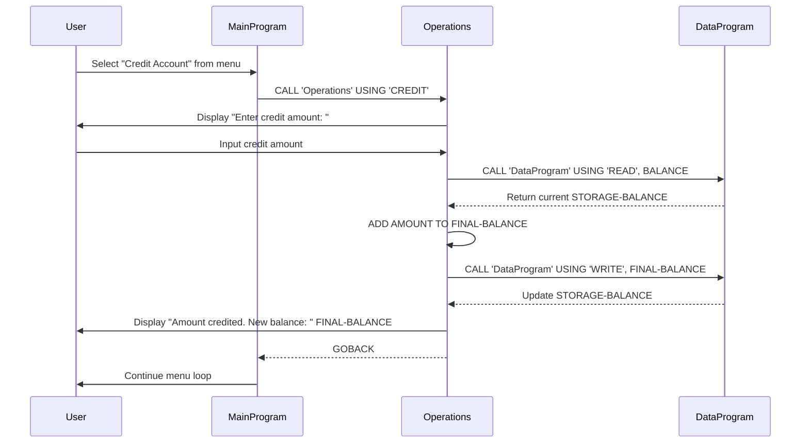

# COBOL Student Account Management System

This project contains a COBOL-based system for managing student accounts, focusing on balance operations such as viewing, crediting, and debiting funds.

## COBOL Files Overview

### data.cob
**Purpose**: Serves as the data layer for storing and retrieving account balance information.

**Key Functions**:
- `READ`: Retrieves the current balance from storage
- `WRITE`: Updates the balance in storage

**Business Rules**:
- Maintains a persistent balance value initialized to $1000.00
- Acts as the central data repository for account balance operations

### main.cob
**Purpose**: Provides the main user interface and program flow control for the account management system.

**Key Functions**:
- Displays a menu-driven interface for account operations
- Handles user input and routes to appropriate operations
- Manages program execution loop until user chooses to exit

**Business Rules**:
- Offers four main operations: View Balance, Credit Account, Debit Account, and Exit
- Validates user input and provides feedback for invalid choices
- Ensures proper program termination

### operations.cob
**Purpose**: Implements the core business logic for account operations including balance inquiries, credits, and debits.

**Key Functions**:
- `TOTAL`: Displays the current account balance
- `CREDIT`: Adds funds to the account
- `DEBIT`: Subtracts funds from the account (with validation)

**Business Rules**:
- **No Overdraft Protection**: Debit operations are only allowed if sufficient funds are available
- **Balance Validation**: System prevents negative balances through insufficient funds checks
- **Real-time Updates**: Balance changes are immediately reflected and persisted
- **User Feedback**: Provides clear messages for successful transactions and errors

## Student Account Business Rules

1. **Initial Balance**: All student accounts start with $1000.00
2. **Credit Operations**: Unlimited credits allowed - students can add any positive amount
3. **Debit Operations**: Only allowed if account balance is sufficient to cover the debit amount
4. **Balance Persistence**: Account balance is maintained across program sessions
5. **Transaction Safety**: All operations validate data integrity before processing

## System Architecture

The system follows a modular design:
- `main.cob` handles user interaction
- `operations.cob` contains business logic
- `data.cob` manages data persistence

This separation allows for maintainable and extensible code structure.

## Sequence Diagram

The following sequence diagram illustrates the data flow for a credit operation in the student account management system:

